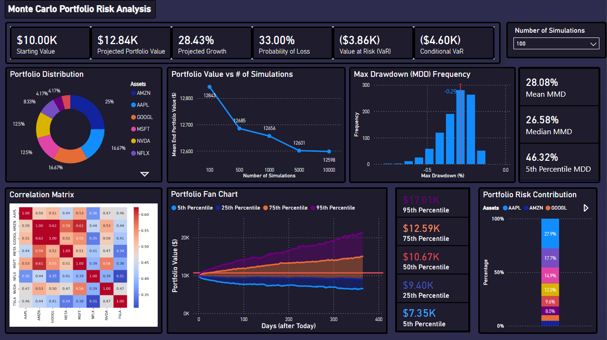

# Portfolio Risk Analysis

## Introduction

### Problem I
Despite the continuous technological advances that have been made in conjunction with the finance industry, <b>there is no model</b> that has accurately captured the dynamic and unpredictable movements of the stock market. The features in order to predict the market are too multi-modal and complex in nature to capture and process. Furthermore, the trajectory of the market depends on future events that are unforseable. There is no definitive model, and there will probably never be one.

To the average investor that is interested in saving long-term, if there is no perfect model, how can one safely grow their portfolio? One way to approach this issue is to <b> account for risk.</b> If an investor can quantify risk, he/she/they can optimize their portfolio that withstand loss. But how do we even quantify risk in the first place? 

### Solution (Monte Carlo Simulation)
One popular solution, to quantify risk as an objective metric, is to see all the potential portfolio values after `N` days using the <b>Monte Carlo Algorithm</b>.

The [Monte Carlo Algorithm](https://en.wikipedia.org/wiki/Monte_Carlo_method) is a mathematical technique that entails utilizing random sampling to estimate the potential outcomes of an uncertain system (in this case, our portfolio value after fluctuations in the stock market).

How do we apply this technique to our portfolio? We randomly sample the movements (events) in the stock market and combine it with out portfolio value. This process requires:
- Compiling share prices over a period of `N` days
- Calculating the variance, mean returns, and the degrees of freedom of each share
- Computing a covariance matrix that captures the relationship between different shares in one portfolio
  - E.g. if NVDA's share price decreases, how will AMZN's share price behave?
- Using linear algebra (matrix multiplication) to simulate how one's portfolio turns out everyday until `N` days is reached
- Do the previous step again many times (e.g. 1000 times) to create a distribution of potential portfolio earnings like a normal distribution or student's t-distribution
- Present the portfolio distribution along with key risk indicators captured such as value at risk (VaR), conditional value at risk (CVaR), and maximum dropdown (MDD) in a dashboard for an investor to decide whether the risk associated with their portfolio is acceptable.

Presenting these metrics in a dashboard gives an investor an objective basis for deciding whether a portfolio's risk profile fits their tolerance:


  
## Comparative Portfolio Analysis
 
### Problem II
 
It is known that investing in a conservative portfolio of index funds (both equities and bonds) is less risky than investing in a tech-concentrated portfolio. Tech shares (e.g. AAPL, AMZN, NVDA) carry unstable prices since their valuations depend heavily on meeting future growth expectations rather than current fundamentals. By theory, Monte Carlo should predict lower risk metrics for the conservative portfolio and higher risk metrics for the tech-concentrated portfolio — but *by how much*?
 
To answer this, the pipeline was run against three portfolios, each starting at $10,000, over 10,000 simulations:
 
- **Conservative (60/40)** — 60% VTI, 40% BND
- **All-Weather (Ray Dalio)** — 30% VTI, 40% TLT, 15% IEF, 7.5% GLD, 7.5% DBC
- **Tech-Concentrated** — NVDA (12.5%), AAPL (16.7%), MSFT (12.5%), AMZN (25%), TSLA (4.16%), META (4.16%), NFLX (8.3%), GOOGL (16.6%)

| Metric | Tech-Concentrated | All-Weather | Conservative |
|---|---|---|---|
| Mean ending value | $12,597.78 | $10,305.38 | $11,034.67 |
| VaR (95%) | -31.5% | -16.9% | -10.7% |
| CVaR (95%) | -40.1% | -20.8% | -15.5% |
| Probability of loss | 30.3% | 43.2% | 23.0% |
| MDD (mean) | -27.7% | -12.5% | -10.8% |
| MDD (median) | -26.1% | -11.5% | -9.9% |
| MDD (5th pct., worst case) | -46.1% | -22.3% | -19.4% |
 
#### Findings
 
**Portfolio value.** As expected, Tech-Concentrated produced the highest ending value ($12,597.78, a 26.0% gain). Unexpectedly, Conservative ($11,034.67) outperformed All-Weather ($10,305.38), despite All-Weather's mandate of delivering steadier, regime-resilient returns. The simulated price history spans the 2022 rate-hike cycle — one of the worst periods on record for long-duration fixed income — and All-Weather's largest position, TLT (20+ year Treasuries, ~17-year duration), is roughly 2–3x more rate-sensitive than Conservative's BND (broad, mixed-maturity bonds, ~6-year duration). Combined with a smaller equity allocation (30% vs. 60%) to capture the subsequent recovery, this explains most of the gap.
 
**Portfolio risk.** VaR, CVaR, and MDD all descend in the expected order — Tech-Concentrated riskiest, Conservative safest — consistent with theory. Probability of loss breaks that pattern: All-Weather has the *highest* probability of ending below its starting value (43.2%), even higher than Tech-Concentrated's (30.3%). This is because severity and frequency of loss are different things. Tech-Concentrated's high expected return shifts its whole outcome distribution above breakeven, so most trials gain — but the minority that don't can be severe (worse CVaR/MDD). All-Weather's expected return is barely positive (3.1% over the horizon), so its distribution sits close to breakeven: losses are common but shallow. **Tech-Concentrated loses less often but loses harder; All-Weather loses more often but loses softer.**
 
**Recommendation.** None of the three is a strict winner. Comparing dollar gain to the magnitude of CVaR (an informal, directional stand-in for a Sharpe ratio — no risk-free rate, uses CVaR instead of standard deviation) shows Tech-Concentrated and Conservative are similarly efficient (~0.65 and ~0.67 gain per unit of tail risk), while All-Weather lags well behind (~0.15) — not because it's the riskiest, but because it delivers neither Tech's return premium nor Conservative's efficiency in this window. This doesn't invalidate All-Weather's risk-parity thesis; it means a 5-year backtest that includes one of the worst bond bear markets on record is a poor test of a strategy built for resilience across decades and multiple regimes.
 
- **Risk-averse investors** should prefer Conservative (60/40) over All-Weather here — similar efficiency to Tech-Concentrated with far less tail exposure.
- **Risk-tolerant investors** are reasonably compensated for Tech-Concentrated's volatility — its return-per-unit-of-risk is on par with Conservative's.
- **All-Weather** is the hardest to recommend from this simulation alone; evaluating its case fairly would need a longer backtest or forward-looking regime analysis.

## Pipeline Architecture
`Data (yfinance) → Python (Monte Carlo + Cholesky) → Risk Metrics → Power BI Dashboard`

## Running the Project

If you want to collect risk metrics for your own portfolio, clone the repo:

```bash
git clone https://github.com/holiday-sean/StockPortfolioRiskAnalysis.git
cd StockPortfolioRiskAnalysis
```

Then add your portfolio as `tickers.csv` in the repo root, with two columns — ticker symbol and number of shares you hold:

```csv
tickers,num_shares
AAPL,10
NVDA,5
```

### Docker (Recommended)

Docker is the recommended path, especially on Windows, since `make` isn't natively available there — the Dockerfile installs it inside the container instead.

1. **Build and run the pipeline:**
   ```bash
   docker-compose up
   ```
   This builds the image (if needed) and runs the full pipeline (`make all`) inside the container. Outputs are written to `data/` in your local repo — the `docker-compose.yml` volume mapping means you'll see the CSVs on your host machine, not just inside the container. (If this step doesn't work, try creating an empty `data/` folder first and re-running.)

2. **Shut down the container:**
   ```bash
   docker-compose down
   ```
   This closes the Docker environment but keeps your generated data files intact.

3. **Re-run after changing your portfolio or starting value:**
   ```bash
   docker-compose up --build
   ```
   Any change to `tickers.csv` or the pipeline scripts requires a rebuild, since the code is copied into the image at build time rather than mounted live.

4. **Start fresh:**
   On Windows (no native `make`), the equivalent of `make clean` is manually deleting everything inside `data/`, then re-running `docker-compose up --build`.

### Conda & Makefile (Linux/macOS)

If you're on Linux or macOS and already have `make` installed, you can skip Docker entirely:

1. **Create and activate the environment:**
   ```bash
   conda env create -f environment.yml
   conda activate portfolio-analysis
   ```

2. **Run the pipeline:**
   ```bash
   make all
   ```

3. **Start fresh:**
   ```bash
   make clean
   make all
   ```

### Viewing your results

Once the pipeline finishes, `data/` will contain the simulation outputs (paths, summary risk stats, convergence sweep, etc. — see [Project Structure](#project-structure) below). Open the Power BI `.pbix` dashboard in Power BI Desktop; on first open, set the `DataFolder` parameter to the absolute path of your local `data/` folder so the dashboard points at your own results rather than needing any code changes.

## Project Structure

```
.
├── Dockerfile                 # Pipeline environment: Python 3.12-slim + make + pinned deps
├── docker-compose.yml         # Maps local data/ into the container; runs `make all` on `up`
├── Makefile                   # Orchestrates pipeline stages and their file dependencies
├── environment.yml            # Pinned conda dependencies for a non-Docker local run
├── tickers.csv                # Your input: ticker symbols + number of shares held
├── src/
│   ├── fetch_portfolio_dist.py   # tickers.csv → data/weights.csv (per-ticker portfolio weight)
│   ├── fetch_prices.py           # tickers.csv → data/prices.csv (5y daily Close, via yfinance)
│   ├── compute_returns.py        # data/prices.csv → data/returns.csv (daily log returns)
│   ├── compute_statistics.py     # data/returns.csv → data/stats.csv, data/covariance_matrix.csv
│   │                              #   (mean return, variance, t-distribution deg. of freedom per asset)
│   ├── simulate_portfolio.py     # Runs the Monte Carlo simulation → data/simulations.csv
│   │                              #   (correlated t-distributed draws via Cholesky decomposition,
│   │                              #    antithetic variates for variance reduction)
│   ├── visualize_results.py      # data/simulations.csv → data/simulation_paths.csv,
│   │                              #   data/simulation_summary.csv, data/mdd_distribution.csv
│   │                              #   (VaR, CVaR, probability of loss, max drawdown)
│   ├── analyze_convergence.py    # Sweeps n_simulations → data/convergence.csv
│   │                              #   (checks whether risk metrics have stabilized)
│   └── compute_risk.py           # covariance_matrix.csv + weights.csv → data/risk_contribution.csv
│                                  #   (variance-based risk decomposition per asset)
├── data/                      # Pipeline outputs — gitignored, regenerated on every run
└── <dashboard>.pbix           # Power BI dashboard: fan chart, MDD histogram,
                                #   covariance heatmap, VaR/CVaR/MDD summary cards
```

## Pipeline flow

```
tickers.csv
   ├──► fetch_portfolio_dist.py ──► weights.csv ──────────────────┐
   └──► fetch_prices.py ──► prices.csv                            │
              │                                                   │
              ▼                                                   │
     compute_returns.py ──► returns.csv                           │
              │                                                   │
              ▼                                                   │
  compute_statistics.py ──► stats.csv, covariance_matrix.csv ─┐   │
              │                                                │   │
              │                                                ▼   ▼
              │                                    simulate_portfolio.py
              │                                                │
              │                                                ▼
              │                                          simulations.csv
              │                                          │         │
              │                                          ▼         ▼
              │                              visualize_results.py   analyze_convergence.py
              │                                          │         │
              │                                          ▼         ▼
              │                           simulation_paths.csv,   convergence.csv
              │                           simulation_summary.csv,
              │                           mdd_distribution.csv
              │
              └──► compute_risk.py (+ weights.csv) ──► risk_contribution.csv
```

## Dependencies

Pipeline dependencies are pinned in `environment.yml`:

| Package | Version | Purpose |
|---|---|---|
| `numpy` | 2.5.1 | Linear algebra (Cholesky decomposition), random number generation |
| `pandas` | 3.0.5 | Data wrangling, CSV I/O |
| `yfinance` | 1.5.2 | Historical price data from Yahoo Finance |
| `scipy` | 1.18.0 | Student's t-distribution fitting (`scipy.stats.t.fit`) |

Install locally with conda:

```bash
conda env create -f environment.yml
conda activate portfolio-analysis
```

If you're using Docker, you don't need to do this — the image installs the same pinned versions via `pip` automatically.

**Power BI dashboard:** the correlation heatmap (derived from the covariance matrix) is rendered as a Python visual inside Power BI Desktop, which relies on Power BI's own separately-configured Python environment (Power BI Options → Python scripting), not the conda environment above. That environment needs `pandas`, `numpy`, `matplotlib`, and `seaborn` available.

**Orchestration:**
- `make` — installed via `apt-get` inside the Docker image; not required on the host if you're using Docker Compose
- Docker / Docker Compose — to build and run the pipeline environment without setting up conda locally
